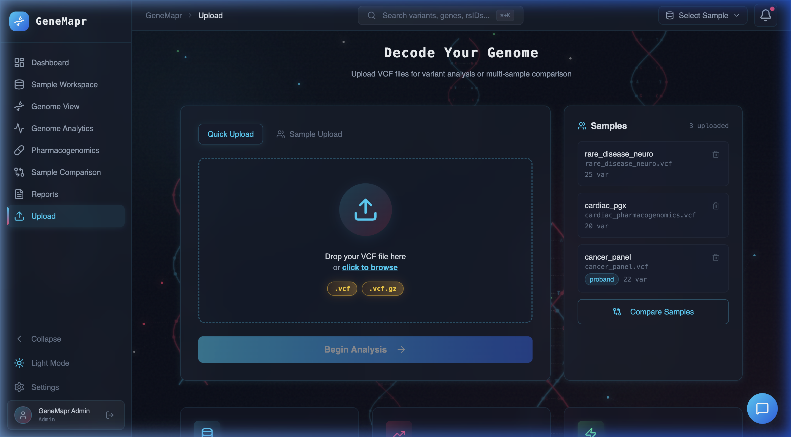
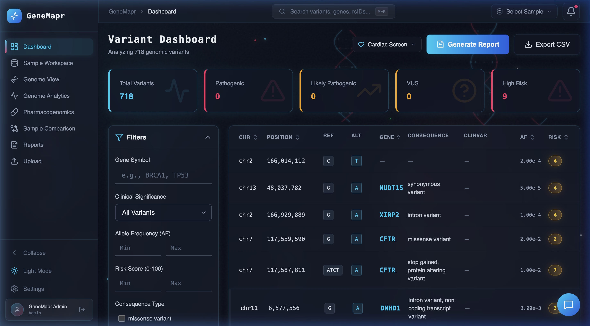
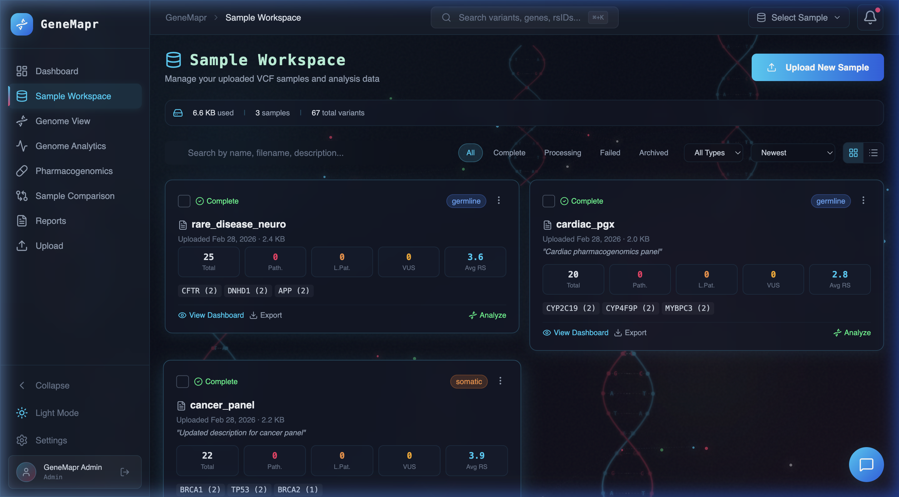
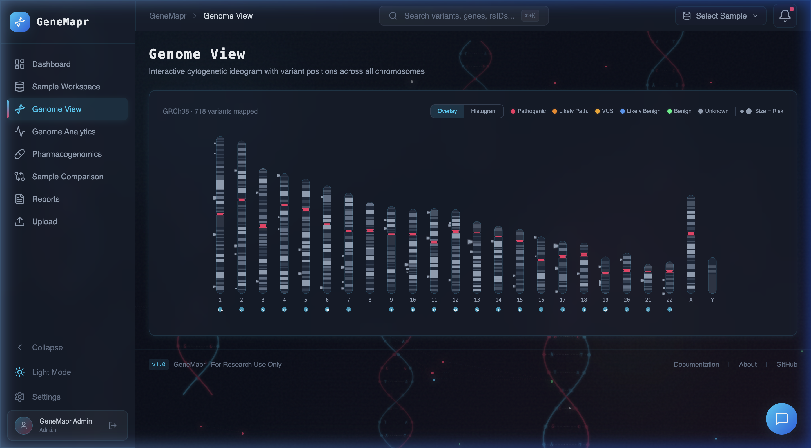
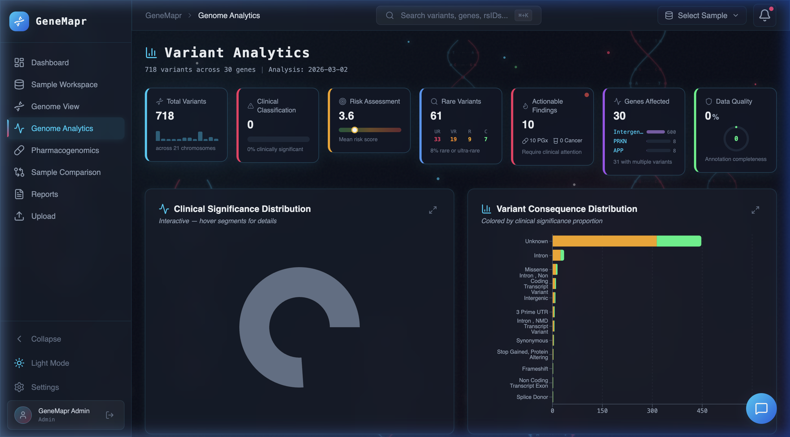
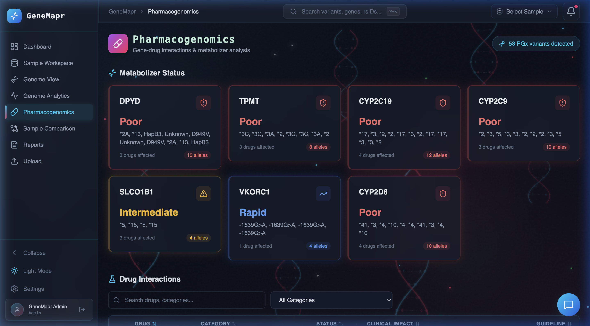
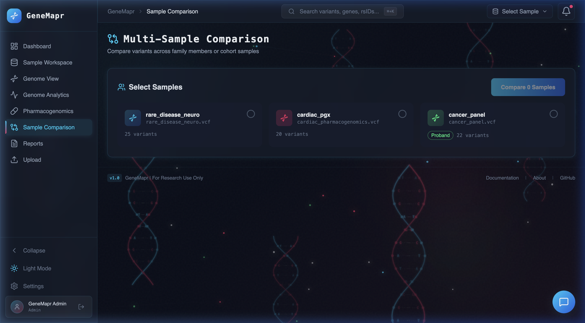
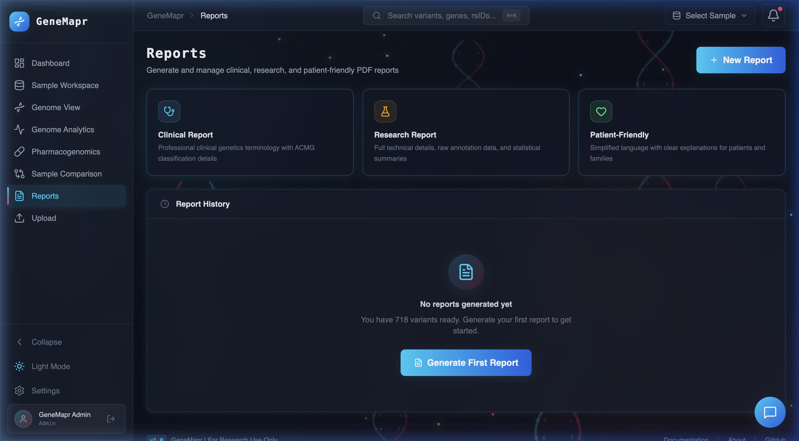
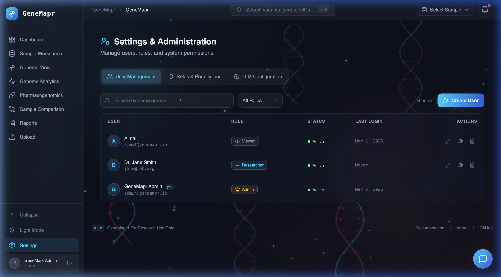

# GeneMapr

**Genomic Variant Interpretation Platform**

A production-ready platform for parsing, annotating, and interpreting genomic variants from VCF files. GeneMapr integrates with ClinVar, gnomAD, and Ensembl to provide comprehensive variant annotations, automated risk scoring, and AI-powered clinical summaries.

---

## Table of Contents

- [Features](#features)
- [Architecture](#architecture)
- [Quick Start](#quick-start)
- [API Documentation](#api-documentation)
- [Tech Stack](#tech-stack)
- [Development](#development)
- [Testing](#testing)
- [Screenshots](#screenshots)
- [License](#license)

---

## Features

✅ **VCF Upload & Parsing** - Robust parsing using pysam with validation
✅ **Multi-Source Annotation** - Integrates ClinVar, gnomAD, and Ensembl APIs
✅ **Intelligent Caching** - Redis-based caching with 24hr TTL for external APIs
✅ **Risk Scoring** - Automated risk scoring based on clinical significance and population frequency
✅ **AI Summaries** - Claude-powered clinical interpretation summaries
✅ **Advanced Filtering** - Filter by gene, consequence, allele frequency, risk score, and more
✅ **CSV Export** - Export filtered results for downstream analysis
✅ **Real-time UI** - React-based interactive dashboard with instant filtering

---

## Architecture

```
┌─────────────────────────────────────────────────────────────────────┐
│                         Frontend (React + TypeScript)               │
│  ┌──────────────┐  ┌──────────────┐  ┌──────────────┐             │
│  │ Upload Page  │  │  Dashboard   │  │ Filter Panel │             │
│  └──────────────┘  └──────────────┘  └──────────────┘             │
└────────────────────────────┬────────────────────────────────────────┘
                             │ HTTP/REST
                             ▼
┌─────────────────────────────────────────────────────────────────────┐
│                      FastAPI Backend (Python 3.11)                  │
│  ┌──────────────────────────────────────────────────────────────┐  │
│  │ API Endpoints                                                 │  │
│  │  • POST /variants/upload    • GET /variants                   │  │
│  │  • GET /variants/{id}       • GET /variants/export/csv        │  │
│  └──────────────────────────────────────────────────────────────┘  │
│                             │                                        │
│  ┌──────────────────────────▼─────────────────────────────────┐    │
│  │ Services Layer                                              │    │
│  │  ┌────────────┐  ┌────────────┐  ┌────────────┐           │    │
│  │  │VCF Parser  │  │ Annotation │  │  Scoring   │           │    │
│  │  │  (pysam)   │  │  Service   │  │  Engine    │           │    │
│  │  └────────────┘  └────────────┘  └────────────┘           │    │
│  └─────────────────────────────────────────────────────────────┘   │
│                             │                                        │
│  ┌──────────────────────────▼─────────────────────────────────┐    │
│  │ External APIs (with Redis caching)                          │    │
│  │  • ClinVar API    • gnomAD API    • Ensembl REST API        │    │
│  └─────────────────────────────────────────────────────────────┘   │
└────────────────────────────┬────────────────────────────────────────┘
                             │
        ┌────────────────────┴────────────────────┐
        ▼                                         ▼
┌─────────────────┐                      ┌─────────────────┐
│   PostgreSQL    │                      │      Redis      │
│   (Variants)    │                      │    (Cache)      │
└─────────────────┘                      └─────────────────┘
```

### Data Flow

1. **Upload** → User uploads VCF file via web UI or API
2. **Parse** → pysam parses VCF, normalizes variants, stores in PostgreSQL
3. **Annotate** → Background task queries ClinVar, gnomAD, Ensembl (cached in Redis)
4. **Score** → Risk scoring algorithm assigns pathogenicity scores
5. **Summarize** → AI generates clinical interpretation summaries
6. **View** → User filters, sorts, and explores variants in dashboard
7. **Export** → Export filtered results as CSV

---

## Quick Start

### Prerequisites

- **Docker** (with Docker Compose)
- **Git**
- (Optional) API key for AI summaries (Claude API)

### Setup

1. **Clone the repository:**
   ```bash
   git clone <repository-url>
   cd GeneMapr
   ```

2. **Configure environment variables:**
   ```bash
   cp .env.example .env
   ```

   Edit `.env` and set:
   ```env
   # Optional: Add your Claude API key for AI summaries
   LLM_API_KEY=your_api_key_here
   ```

3. **Start all services:**
   ```bash
   docker-compose up --build
   ```

   This starts:
   - PostgreSQL (port 5432)
   - Redis (port 6379)
   - Backend API (port 8000)
   - Frontend UI (port 5173)

4. **Access the application:**
   - **Frontend UI:** http://localhost:5173
   - **Backend API:** http://localhost:8000
   - **API Docs (Swagger):** http://localhost:8000/docs
   - **API Docs (ReDoc):** http://localhost:8000/redoc

### Test with Sample Data

Upload the included sample VCF file:

**Using the Web UI:**
- Navigate to http://localhost:5173
- Click "Upload VCF"
- Select `test_data/sample.vcf`
- View results in the dashboard

**Using cURL:**
```bash
curl -X POST "http://localhost:8000/variants/upload" \
  -F "file=@test_data/sample.vcf"
```

**Response:**
```json
{
  "status": "success",
  "variant_count": 5,
  "upload_id": "uuid-here",
  "message": "Successfully parsed and stored 5 variants. Annotation in progress."
}
```

---

## API Documentation

### Base URL
- **Development:** `http://localhost:8000`
- **Production:** Configure via `BACKEND_URL` environment variable

### Authentication
Currently open. Add API key authentication in production.

---

### Endpoints

#### 1. Upload VCF File

**`POST /variants/upload`**

Upload and parse a VCF file. Triggers background annotation.

**Request:**
- **Content-Type:** `multipart/form-data`
- **Body:** VCF file (`.vcf` or `.vcf.gz`)

**Response:**
```json
{
  "status": "success",
  "variant_count": 42,
  "upload_id": "a1b2c3d4-e5f6-7890-abcd-ef1234567890",
  "message": "Successfully parsed and stored 42 variants. Annotation in progress."
}
```

**Example:**
```bash
curl -X POST "http://localhost:8000/variants/upload" \
  -F "file=@/path/to/sample.vcf"
```

**Error Codes:**
- `400` - Invalid file format or VCF parsing error
- `500` - Server error processing file

---

#### 2. List Variants (Paginated & Filtered)

**`GET /variants`**

Retrieve variants with pagination and optional filters.

**Query Parameters:**

| Parameter       | Type    | Default | Description                                    |
|----------------|---------|---------|------------------------------------------------|
| `page`         | integer | 1       | Page number (≥1)                               |
| `page_size`    | integer | 20      | Items per page (1-100)                         |
| `gene`         | string  | -       | Filter by gene symbol (exact match)            |
| `significance` | string  | -       | Filter by ClinVar significance (partial match) |
| `af_max`       | float   | -       | Maximum allele frequency (0-1)                 |
| `consequence`  | string  | -       | Filter by consequence type (partial match)     |
| `min_score`    | integer | -       | Minimum risk score (≥0)                        |
| `max_score`    | integer | -       | Maximum risk score (≥0)                        |

**Response:**
```json
{
  "variants": [
    {
      "id": "uuid",
      "chrom": "17",
      "pos": 43094692,
      "ref": "G",
      "alt": "A",
      "rs_id": "rs80357906",
      "gene_symbol": "BRCA1",
      "consequence": "missense_variant",
      "protein_change": "p.Gly1738Arg",
      "clinvar_significance": "Pathogenic",
      "gnomad_af": 0.000012,
      "risk_score": 85,
      "ai_summary": "This variant is classified as pathogenic...",
      "annotation_status": "completed"
    }
  ],
  "total": 42,
  "page": 1,
  "page_size": 20
}
```

**Example:**
```bash
# Get all variants (first page)
curl "http://localhost:8000/variants"

# Filter for pathogenic variants in BRCA1 with AF < 0.01%
curl "http://localhost:8000/variants?gene=BRCA1&significance=pathogenic&af_max=0.0001"

# High-risk variants only
curl "http://localhost:8000/variants?min_score=70"
```

---

#### 3. Get Single Variant

**`GET /variants/{variant_id}`**

Retrieve detailed information for a single variant.

**Path Parameters:**
- `variant_id` (UUID) - Variant identifier

**Response:**
```json
{
  "id": "uuid",
  "chrom": "17",
  "pos": 43094692,
  "ref": "G",
  "alt": "A",
  "rs_id": "rs80357906",
  "gene_symbol": "BRCA1",
  "transcript_id": "ENST00000357654",
  "consequence": "missense_variant",
  "protein_change": "p.Gly1738Arg",
  "clinvar_significance": "Pathogenic",
  "clinvar_review_status": "criteria provided, multiple submitters",
  "clinvar_condition": "Breast-ovarian cancer, familial, susceptibility to, 1",
  "gnomad_af": 0.000012,
  "gnomad_ac": 15,
  "gnomad_an": 1234567,
  "risk_score": 85,
  "ai_summary": "Detailed clinical interpretation...",
  "qual": 100.0,
  "filter_status": "PASS",
  "depth": 50,
  "allele_freq": 0.48,
  "upload_id": "uuid",
  "annotation_status": "completed",
  "created_at": "2026-02-26T23:15:00Z"
}
```

**Error Codes:**
- `404` - Variant not found

---

#### 4. Export Variants to CSV

**`GET /variants/export/csv`**

Export filtered variants as a CSV file.

**Query Parameters:**
Same as `GET /variants` (all filter parameters supported).

**Response:**
- **Content-Type:** `text/csv`
- **Filename:** `variants_export.csv`

**CSV Columns:**
ID, Chromosome, Position, Reference, Alternate, rsID, Gene, Transcript, Consequence, Protein Change, ClinVar Significance, ClinVar Review Status, ClinVar Condition, gnomAD AF, gnomAD AC, gnomAD AN, Risk Score, Quality, Filter Status, Depth, Allele Frequency, Upload ID, Annotation Status, Created At

**Example:**
```bash
# Export all pathogenic BRCA1 variants
curl "http://localhost:8000/variants/export/csv?gene=BRCA1&significance=pathogenic" \
  -o brca1_pathogenic.csv
```

---

#### 5. Health Check

**`GET /health`**

Check service health.

**Response:**
```json
{
  "status": "healthy"
}
```

---

## Tech Stack

### Backend

| Technology        | Version  | Purpose                                |
|-------------------|----------|----------------------------------------|
| Python            | 3.11     | Runtime                                |
| FastAPI           | ≥0.115.0 | Web framework                          |
| Pydantic          | ≥2.6.0   | Data validation                        |
| SQLAlchemy        | ≥2.0.30  | ORM (async)                            |
| PostgreSQL        | 16       | Primary database                       |
| Redis             | 7        | Caching layer                          |
| pysam             | ≥0.22.0  | VCF parsing                            |
| httpx             | ≥0.27.0  | Async HTTP client                      |
| Alembic           | ≥1.13.0  | Database migrations                    |

### Frontend

| Technology        | Version  | Purpose                                |
|-------------------|----------|----------------------------------------|
| React             | 18.3     | UI framework                           |
| TypeScript        | 5.5      | Type safety                            |
| Vite              | 5.3      | Build tool                             |
| TailwindCSS       | 3.4      | Styling                                |
| TanStack Table    | 8.13     | Data tables                            |
| TanStack Query    | 5.28     | Data fetching                          |
| React Router      | 6.22     | Routing                                |
| Axios             | 1.6      | HTTP client                            |

### Infrastructure

- **Docker** - Containerization
- **Docker Compose** - Multi-container orchestration
- **GitHub Actions** (recommended) - CI/CD

---

## Development

### Project Structure

```
GeneMapr/
├── backend/
│   ├── alembic/                  # Database migrations
│   ├── app/
│   │   ├── api/                  # API endpoints
│   │   │   └── variants.py       # Variant endpoints
│   │   ├── core/                 # Core configuration
│   │   │   ├── config.py         # Settings
│   │   │   ├── database.py       # DB connection
│   │   │   └── redis.py          # Redis connection
│   │   ├── models/               # SQLAlchemy models
│   │   │   └── variant.py        # Variant model
│   │   ├── schemas/              # Pydantic schemas
│   │   │   └── variant.py        # Request/response schemas
│   │   ├── services/             # Business logic
│   │   │   ├── vcf_parser.py     # VCF parsing
│   │   │   ├── annotation_service.py
│   │   │   ├── clinvar_service.py
│   │   │   ├── gnomad_service.py
│   │   │   ├── ensembl_service.py
│   │   │   ├── scoring_service.py
│   │   │   └── ai_summary_service.py
│   │   ├── utils/                # Utilities
│   │   │   └── normalization.py  # Variant normalization
│   │   └── main.py               # FastAPI app
│   ├── Dockerfile
│   └── requirements.txt
├── frontend/
│   ├── src/
│   │   ├── components/           # React components
│   │   │   ├── Layout.tsx
│   │   │   ├── ErrorBoundary.tsx
│   │   │   ├── LoadingSpinner.tsx
│   │   │   ├── FilterPanel.tsx
│   │   │   ├── VariantTable.tsx
│   │   │   └── VariantDetailModal.tsx
│   │   ├── pages/                # Page components
│   │   │   ├── UploadPage.tsx
│   │   │   └── DashboardPage.tsx
│   │   ├── App.tsx               # Main app
│   │   ├── main.tsx              # Entry point
│   │   └── index.css             # Global styles
│   ├── Dockerfile
│   ├── package.json
│   ├── tsconfig.json
│   ├── vite.config.ts
│   └── tailwind.config.js
├── test_data/
│   └── sample.vcf                # Sample VCF file
├── docker-compose.yml
├── .env.example
├── .gitignore
├── CLAUDE.md                     # Project conventions
└── README.md
```

---

### Backend Development

**Install dependencies (local development):**
```bash
cd backend
python -m venv venv
source venv/bin/activate  # On Windows: venv\Scripts\activate
pip install -r requirements.txt
```

**Run backend locally:**
```bash
uvicorn app.main:app --reload --host 0.0.0.0 --port 8000
```

**Run tests:**
```bash
pytest
pytest -v  # Verbose
pytest --cov=app  # With coverage
```

**Code formatting:**
```bash
black app/
ruff check app/
ruff check app/ --fix
```

**Database migrations:**
```bash
# Create new migration
alembic revision --autogenerate -m "description"

# Apply migrations
alembic upgrade head

# Rollback
alembic downgrade -1
```

---

### Frontend Development

**Install dependencies:**
```bash
cd frontend
npm install
```

**Run dev server:**
```bash
npm run dev
```

**Build for production:**
```bash
npm run build
npm run preview  # Preview production build
```

**Lint code:**
```bash
npm run lint
```

---

## Testing

### Backend Tests

```bash
cd backend
pytest
```

**Test coverage includes:**
- VCF parsing with pysam
- Variant normalization
- Annotation service integration
- Database models and queries
- API endpoints

### Frontend Tests

```bash
cd frontend
npm test
```

### Integration Testing

Use the sample VCF file to test the full pipeline:

```bash
# 1. Upload VCF
curl -X POST "http://localhost:8000/variants/upload" \
  -F "file=@test_data/sample.vcf"

# 2. Wait for annotation (check logs)
docker-compose logs -f backend

# 3. Verify variants are annotated
curl "http://localhost:8000/variants" | jq

# 4. Test filtering
curl "http://localhost:8000/variants?significance=pathogenic"

# 5. Test export
curl "http://localhost:8000/variants/export/csv" -o test_export.csv
```

---

## Screenshots

### 🎬 App Slideshow

<table>
  <tr>
    <td align="center"><b>Upload & VCF Parsing</b></td>
    <td align="center"><b>Variant Dashboard</b></td>
    <td align="center"><b>Sample Workspace</b></td>
  </tr>
  <tr>
    <td></td>
    <td></td>
    <td></td>
  </tr>
  <tr>
    <td align="center"><b>Genome View</b></td>
    <td align="center"><b>Genome Analytics</b></td>
    <td align="center"><b>Pharmacogenomics</b></td>
  </tr>
  <tr>
    <td></td>
    <td></td>
    <td></td>
  </tr>
  <tr>
    <td align="center"><b>Sample Comparison</b></td>
    <td align="center"><b>Reports</b></td>
    <td align="center"><b>Settings</b></td>
  </tr>
  <tr>
    <td></td>
    <td></td>
    <td></td>
  </tr>
</table>

---

### Upload Page
Upload VCF files with drag-and-drop or file browser. Supports `.vcf` and `.vcf.gz` formats with real-time sample tracking.


---

### Variant Dashboard
Interactive variant table with advanced filtering by gene symbol, clinical significance, allele frequency, risk score, and consequence type. Summary cards show pathogenic, likely pathogenic, VUS, and high-risk counts at a glance.


---

### Sample Workspace
Manage all uploaded samples in one place. View variant counts, file details, and proband labels. Supports multi-sample workflows.


---

### Genome View
Interactive cytogenetic ideogram for visualizing variant positions across all chromosomes.


---

### Genome Analytics
Visual breakdown of variant distributions by clinical significance and consequence type with interactive charts.


---

### Pharmacogenomics
Detailed metabolizer status for key pharmacogenes (DPYD, TPMT, CYP2C19, CYP2C9, SLCO1B1, VKORC1, CYP2D6) with drug interaction analysis.


---

### Sample Comparison
Multi-sample and family-based cohort analysis interface for comparing genomic profiles across samples.


---

### Reports
Generate and manage clinical, research, and patient-friendly PDF reports from analyzed variant data.


---

### Settings
User management, administration panel, and application configuration including LLM model selection.


---

## Production Deployment

### Environment Configuration

1. **Set strong passwords** in `.env`:
   ```env
   POSTGRES_PASSWORD=your_secure_password
   ```

2. **Configure CORS** for production domains:
   ```python
   # backend/app/main.py
   allow_origins=["https://yourdomain.com"]
   ```

3. **Add API authentication** (recommended):
   - Implement API key middleware
   - Add JWT authentication for user sessions

4. **Enable HTTPS**:
   - Use a reverse proxy (nginx, Traefik)
   - Obtain SSL certificates (Let's Encrypt)

5. **Scale services**:
   - Add PostgreSQL replicas for read queries
   - Increase Redis memory for larger cache
   - Run multiple backend instances behind a load balancer

---

## Troubleshooting

### Backend won't start

**Check logs:**
```bash
docker-compose logs backend
```

**Common issues:**
- PostgreSQL not ready → Wait for health check to pass
- Missing environment variables → Check `.env` file
- Port 8000 already in use → Change `BACKEND_PORT` in `.env`

### Annotation failing

**Check API connectivity:**
```bash
# From backend container
docker exec -it genemapr_backend curl -I https://rest.ensembl.org
```

**Common issues:**
- Rate limiting → Redis cache should prevent this
- Network issues → Check firewall/proxy settings
- Invalid variant format → Check normalization logic

### Frontend can't connect to backend

**Verify API URL:**
```bash
# Check frontend environment
docker exec -it genemapr_frontend env | grep VITE_API_URL
```

**Should be:** `http://localhost:8000`

---

## Contributing

1. Fork the repository
2. Create a feature branch: `git checkout -b feature/amazing-feature`
3. Follow code conventions in `CLAUDE.md`
4. Write tests for new features
5. Run linters: `black`, `ruff`, `eslint`
6. Commit changes: `git commit -m 'Add amazing feature'`
7. Push to branch: `git push origin feature/amazing-feature`
8. Open a Pull Request

---

## License

MIT License - see LICENSE file for details

---

## Support

- **Issues:** [GitHub Issues](https://github.com/yourusername/GeneMapr/issues)
- **Discussions:** [GitHub Discussions](https://github.com/yourusername/GeneMapr/discussions)

---

**Built with ❤️ for the genomics community**
